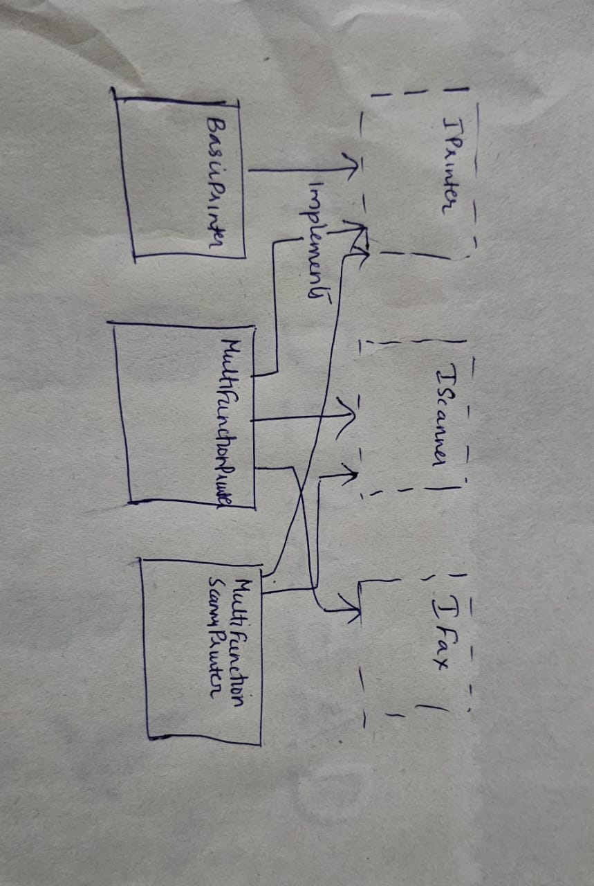

# Interface Segmentation - Multi Function Printer (Java)
Demonstration of Interface Segregation Principle in java.
# Overview
Interface Segmentation, also called the Interface Segregation Principle, one of the core principles of object-oriented design. This project demonstrates the ISP. According to ISP, no client should be forced to depend on interfaces it does not use. Basically, it motivates creation of smaller and specific interfaces rather than a single large and multipurpose one.  

Using this principle, ensures that the system is flexible and also each part of the system would have a specific well-defined role, avoiding unnecessary dependencies and making the system more modular.
# Design
This project uses the example of multi-function printer to demonstrate ISP. A single IDevice interface would force a simple, print only device to implement methods for scan() and fax(), thereby violating the principle.

So, role-based small interfaces like IPrinter, IScanner, IFax were defined for each function. A class can then based on the functionality implement the necessary interfaces.

Key components

`IFax` : Interface for the fax functionality

`IScan` : Interface for the scan functionality

`IPrinter` : Interface for the print functionality

`MultiFunctionPrinter` : Supports printing, scanning, fax

`BasicPrinter` : Supports only printing

`MultiFunctionScannerPrinter` : Supports only printing and scanning

`MultiFunctionFaxPrinter` : Supports only printing and fax

# Class Diagram

